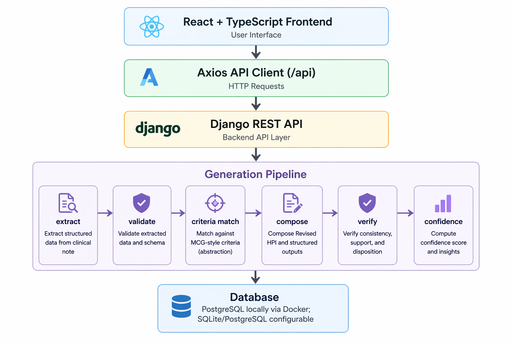

# Clinical Note Structuring Tool (Demo Project for AHMC Take-Home Assessment)

## Important: Do Not Use Real Clinical Data

This project is a **technical demonstration** and should **not be used with real patient data**.

Although the system includes a lightweight PHI/PII protection layer, such as redaction of names, SSN, phone numbers, emails, DOB, MRN/patient IDs, and labeled addresses before LLM calls, it is **not designed to be HIPAA-compliant** and does not provide guarantees for handling protected health information.

### Why this matters

This system uses an LLM-based pipeline to process clinical notes. Even with safeguards, sending real patient data to external or locally hosted models introduces potential risks, including:

- Incomplete or imperfect de-identification, because regex-based redaction is not exhaustive
- Possible data exposure through model providers, infrastructure, logs, or debugging layers
- Lack of formal production compliance controls, such as audit logging, access control, encryption policies, and regulatory review

### Design decision

For this reason, the system is intentionally designed as a **development/demo environment**.

- Original notes are preserved for user review
- A lightweight redaction layer is applied before LLM interaction
- Safety mechanisms such as uncertainty handling, verification, and confidence scoring focus on **reasoning quality**, not regulatory compliance

This allows rapid iteration on clinical reasoning structure, LLM pipeline design, validation logic, and verification strategies without creating false assumptions of production-level data safety.

> If deployed in a real-world clinical setting, this system would require a fully compliant data-handling pipeline, including robust de-identification, secure infrastructure, access control, audit logging, and regulatory review.

---

## Overview

A full-stack clinical note structuring system that converts unstructured ER/H&P notes into structured clinical data and an admission-supporting Revised HPI using a multi-stage, verifiable pipeline.

The system follows a structured multi-stage pipeline (detailed below) to transform clinical notes into structured outputs and a Revised HPI.

##  Design Decisions & Trade-offs

### 1. Multi-Stage Pipeline over Single LLM Call

Instead of relying on a single prompt to generate the final output, the system uses a structured multi-stage pipeline:

extract → validate → criteria → compose → verify → confidence

This design improves:

- **Reliability** — structured intermediate outputs reduce failure modes  
- **Debuggability** — each stage is independently inspectable  
- **Hallucination control** — validation, verification, and uncertainty layers prevent unsupported claims  

---

### 2. Explicit Uncertainty Handling

Rather than implicitly assuming missing data, the system explicitly surfaces uncertainties (e.g., missing labs, vitals, duration).

This ensures:

- No hallucinated clinical values  
- Transparency for reviewers  
- Safer downstream decision interpretation  

---

### 3. Verification + Limited Retry Strategy (Demo-Oriented)

A verification step is used to detect:

- Unsupported claims  
- Inconsistency with structured data  
- Disposition mismatches  

In this demo version:

- The system performs **at most one retry** if verification fails  
- Additional issues are surfaced as **warnings instead of repeated regeneration**

#### Rationale

- Keeps system behavior **deterministic and predictable**  
- Avoids excessive LLM calls and latency  
- Reduces cost during development/demo usage  

This reflects a trade-off:

> Prioritize **traceability and stability** over aggressive auto-correction

In a production system, a more advanced retry or self-correction loop could be implemented.

---

### 4. Warning-Centric Design

Instead of forcing the model to "fix everything," the system:

- Surfaces issues via warnings  
- Preserves imperfect but explainable outputs  
- Relies on human review for final validation  

This aligns with:

> Human-in-the-loop clinical workflows

---

### 5. Admission Support Confidence (Rule-Based)

A deterministic scoring system is used to estimate documentation support for admission decisions.

The score incorporates:

- Verification results  
- Criteria (MCG-style) support  
- Missing clinical data  
- Low-information input penalties  

This provides:

- **Explainable confidence** (not black-box probability)  
- **Calibration** against incomplete inputs  

---

### 6. Lightweight PHI Protection

A simple redaction layer is applied before sending data to the LLM to remove:

- Names (when labeled)  
- SSN  
- Phone numbers  
- Emails  
- DOB / MRN / addresses  

#### Trade-off

- Fast to implement  
- Suitable for development/demo  

But:

- Not exhaustive  
- Not HIPAA-compliant  

---

### 7. External LLM vs Local Model (Cost vs Privacy Trade-off)

For this demo, the system uses an external LLM provider (OpenAI API) to:

- Reduce infrastructure complexity  
- Accelerate development  
- Simplify deployment  

#### Trade-off

- Lower setup cost and faster iteration  
- But not suitable for real patient data environments  

In a production setting:

- The system should be adapted to use a **private/local model deployment**  
- With secure infrastructure and compliance controls  

---

### 8. Design Philosophy

This project prioritizes:

- **Traceability over opacity**  
- **Explicit uncertainty over silent assumptions**  
- **Human review over full automation**  
- **Practical demo constraints over production complexity**

---

## Key Features

- Structured output generation from free-text clinical notes:
  - Chief Complaint
  - HPI Summary
  - Key Findings
  - Suspected Conditions
  - Disposition Recommendation
  - Uncertainties / Missing Information
  - Revised HPI
- Multi-stage backend pipeline, not a single LLM call
- Validation, verification, and optional retry mechanism
- Explicit uncertainty handling to avoid unsupported claims
- Admission-support confidence scoring
- Traceable generation insights:
  - generation warnings
  - verification result
  - criteria / MCG-style matching result
  - confidence score
- Human-in-the-loop workflow:
  - review generated result
  - edit final result
  - save final version
  - reopen saved cases

---

## System Architecture

The system follows a layered architecture from frontend to backend, with a structured generation pipeline:

The following diagram illustrates the end-to-end data flow:



The generation pipeline is implemented as a multi-stage process:
extract → validate → criteria match → compose → verify → confidence

This architecture separates concerns between:
- UI interaction (frontend)
- API handling (backend)
- reasoning and transformation (pipeline)
- persistence (database)

---

## End-to-End Workflow

1. User inputs clinical note text using ER note, H&P note, or combined original clinical note fields.
2. The frontend merges note sources into a single `original_note`.
3. The case is created through `POST /api/cases/`.
4. The user triggers generation through `POST /api/cases/:id/generate/`.
5. The backend runs the generation pipeline.
6. The generated result is persisted.
7. The frontend displays structured output, Revised HPI, and generation insights.
8. The user reviews and edits the final result.
9. The final edited version is saved through `PUT /api/cases/:id/save/`.
10. The case can later be reopened with both the machine-generated result and the human-edited final result.

Backend generation flow:

```text
original_note
  → extract structured output
  → validate structured data
  → match criteria / MCG-style logic
  → reconcile disposition when applicable
  → compose Revised HPI
  → verify output
  → optional one-pass retry
  → build warnings
  → calculate admission-support confidence
  → build uncertainties
  → persist GeneratedResult
```

---

## Generation Pipeline Design

This project intentionally avoids a single-call LLM design. Instead, it uses a staged pipeline so that each step is easier to validate, inspect, and improve.

### 1. Extraction

The system converts free-text clinical notes into structured JSON fields.

### 2. Validation

The structured output is normalized and checked for schema consistency. This helps ensure that downstream rendering, editing, saving, and verification use a consistent data shape.

### 3. Criteria Matching

The backend applies rule-based criteria matching where applicable. In the current version, the criteria layer focuses on diabetes-related admission-support patterns and MCG-style reasoning.

### 4. Revised HPI Composition

The system composes a Revised HPI from structured facts instead of directly rewriting the raw note. This helps reduce unsupported claims and keeps the narrative aligned with extracted clinical evidence.

### 5. Verification

The verifier checks the generated Revised HPI and structured output for:

- unsupported claims
- missing key facts
- factual consistency
- disposition consistency
- criteria alignment issues
- missing data needed for confident interpretation

### 6. Optional Retry

If verification indicates that regeneration is needed, the system performs one targeted retry rather than repeatedly looping without control.

### 7. Warning and Confidence Generation

The system builds user-facing generation warnings and calculates an explainable Admission Support Confidence score based on factors such as:

- verifier result
- criteria support level
- critical missing data
- general missing clinical information
- unsupported claims
- disposition inconsistency
- low-information input

### 8. Uncertainty Handling

The system explicitly surfaces missing or uncertain information instead of inventing it. This includes both condition-specific missing information and general clinical completeness checks.

---

## Traceability and Explainability

Each generated case can include:

- Generation Warnings
- Persisted Warnings
- Verification Result
- Criteria / MCG-style Matching Output
- Admission Support Confidence Score
- Explicit Uncertainty List

This design allows reviewers to understand:

- what the system generated
- what clinical facts supported the result
- what information was missing
- whether the generated result passed verification
- how reliable the admission-support reasoning appears to be

The generated result and the human-edited final result are stored separately. This keeps machine output auditable while preserving the final reviewed version.

---

## Hallucination and Safety Guardrails

The system includes several safeguards against unsupported output:

- Prompt constraints that instruct the model to use only supported facts
- Structured schema validation
- General missing-information detection
- Condition-specific missing checks
- Revised HPI verification
- Optional one-pass retry
- Confidence penalties for missing or low-information input
- Human review and editing before final save

These safeguards do not eliminate all risks, but they make the system more transparent and easier to review.

---

## PHI / PII Protection Layer

Before clinical note content is sent to the LLM, the backend applies lightweight redaction for obvious PHI/PII patterns, including:

- labeled names
- SSN
- phone numbers
- emails
- DOB
- MRN / patient IDs
- labeled addresses

The original note remains stored for user review, while redacted text is used for LLM interaction.

This redaction layer is intentionally lightweight and regex-based. It is useful as a demo safeguard but should not be treated as full clinical de-identification.

### Use of Abstracted Criteria (No Direct MCG / Case Data Usage)

This project does **not** use real MCG guidelines or any Case A / Case B data directly as prompts or training inputs.

Instead, the system adopts an **abstracted criteria approach**, where:

- Admission-support logic is implemented through **generalized, rule-based patterns**
- Clinical reasoning signals (e.g., treatment failure, persistent symptoms, need for monitoring) are represented in a **de-identified and simplified form**
- No real patient cases, proprietary datasets, or identifiable clinical records are used in prompt construction

#### Rationale

- Avoids potential HIPAA and data privacy concerns  
- Prevents leakage of sensitive or proprietary clinical data into LLM prompts  
- Ensures the system remains a **safe demo environment** for evaluation  

This design intentionally prioritizes **privacy and abstraction over strict clinical fidelity**.

In a production environment, integration with real clinical guidelines (e.g., MCG) would require:

- Proper licensing and access control  
- Secure data handling and audit mechanisms  
- Compliance with healthcare data regulations  

---

## Data Model Overview

### Case

Stores the original case record and original note text.

Key responsibilities:

- case title
- original clinical note
- case status
- latest disposition
- whether user edits exist

### GeneratedResult

Stores the machine-generated structured output and traceability metadata.

Key responsibilities:

- generated Chief Complaint
- generated HPI Summary
- generated Key Findings
- generated Suspected Conditions
- generated Disposition
- generated Uncertainties
- generated Revised HPI
- generation warnings
- verification result
- criteria / MCG result
- confidence result

### EditedResult

Stores the human-reviewed final version.

Key responsibilities:

- final edited structured fields
- final edited Revised HPI
- list of edited fields
- last edited timestamp

---

## API Overview

| Method | Endpoint | Purpose |
|---|---|---|
| `GET` | `/api/cases/` | List saved cases |
| `POST` | `/api/cases/` | Create a new case |
| `GET` | `/api/cases/:id/` | Retrieve a case by ID |
| `DELETE` | `/api/cases/:id/` | Delete a case |
| `POST` | `/api/cases/:id/generate/` | Generate structured output and Revised HPI |
| `PUT` | `/api/cases/:id/save/` | Save final edited result |
| `POST` | `/api/uploads/parse-note/` | Parse uploaded PDF/DOCX note text |

---

## Project Structure

```text
clinical-note-support-agent/
├── backend/
│   ├── manage.py
│   ├── requirements.txt
│   ├── .env.example
│   ├── apps/
│   └── config/
├── frontend/
│   ├── src/
│   ├── package.json
│   ├── vite.config.ts
│   └── index.html
├── docker-compose.yml
├── README.md
└── .gitignore
```

---

## Backend Setup

```bash
cd backend
python -m venv .venv
source .venv/bin/activate  # Windows: .venv\Scripts\activate
pip install -r requirements.txt
cp .env.example .env
python manage.py migrate
python manage.py runserver
```

---

## Frontend Setup

```bash
cd frontend
npm install
npm run dev
```

The frontend proxies `/api` requests to the backend during local development.

---

## Local PostgreSQL with Docker

From the repository root:

```bash
docker compose up -d
```

Then run backend migrations:

```bash
cd backend
python manage.py migrate
```

---

## Environment Variables

Create `backend/.env` from `backend/.env.example` and configure the backend settings.

Typical values include:

```env
DJANGO_SECRET_KEY=change-this-before-production
DJANGO_DEBUG=True
DJANGO_ALLOWED_HOSTS=127.0.0.1,localhost

POSTGRES_DB=clinical_notes
POSTGRES_USER=postgres
POSTGRES_PASSWORD=postgres
POSTGRES_HOST=localhost
POSTGRES_PORT=5432

LLM_PROVIDER=openai
OPENAI_API_KEY=your-api-key
OPENAI_MODEL=gpt-4o-mini
```

Adjust values as needed for your local or deployed environment.

---

## AI Tool Usage Disclosure

AI-assisted tools, including ChatGPT, Codex, and Gemini, were used during development for:

- frontend scaffolding and UI iteration
- API integration patterns
- backend utility implementation support
- prompt refinement
- debugging assistance
- documentation drafting

Core design decisions were manually designed, reviewed and refined, including:

- multi-stage generation pipeline architecture
- validation and verification strategy
- uncertainty handling
- admission-support confidence scoring
- traceability design
- PHI/PII protection design

All AI-assisted code was reviewed, tested, and modified as needed to fit the project architecture and assessment requirements.

---

## Verification and Smoke Testing

The project was manually smoke-tested for:

- creating a case
- generating structured output and Revised HPI
- editing and saving final results
- reopening saved cases
- preserving traceability metadata after reload
- handling missing-information cases without hallucinating unsupported labs, vitals, or treatments
- handling weak input without overcommitting to diagnosis or disposition
- upload parsing success and graceful failure behavior

---

## Limitations

- This is a take-home/demo project, not a production clinical system.
- PHI/PII redaction is lightweight and regex-based.
- Confidence scoring is deterministic and rule-based, not a calibrated clinical probability.
- Criteria matching is condition-limited and currently strongest for diabetes-related admission-support patterns.
- Missing-information detection is heuristic-based and not exhaustive.
- LLM output still requires human review.

---

## Future Improvements

If given more time, useful improvements would include:

- broader condition-specific admission criteria
- stronger clinical evidence attribution from generated fields back to source sentences
- more polished human-readable verification summaries
- role-based access control and audit logging
- full production-grade de-identification pipeline
- deployment hardening and monitoring
- expanded automated tests for generation edge cases
- additional multi-layer validation, including extraction output validation, field-level independent validators, and cross-component consistency checks.
- with potential integration of locally deployed LLM models for validation and privacy-sensitive workflows

---

## Final Note

This project demonstrates a full-stack clinical note structuring workflow with an emphasis on engineering clarity, traceability, uncertainty handling, and human review. It is intended for evaluation and demonstration only, not for direct use with real clinical data.
